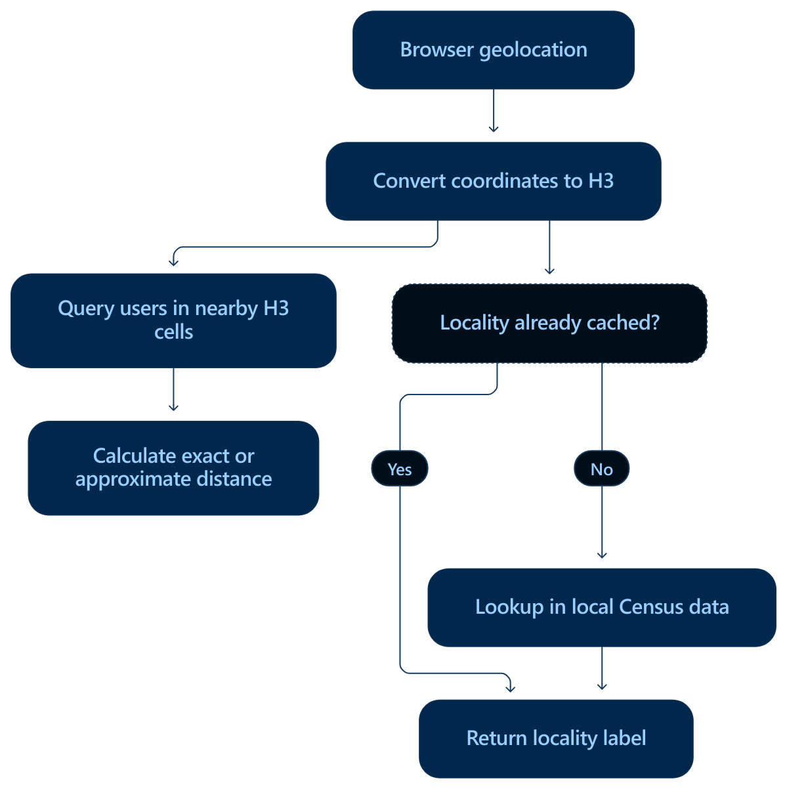

# MLink Project Design

## Architecture

Keep it simple.  Don't repeat yourself.

MLink is a local-first, mobile-first Progressive Web App (PWA). Its user interface is framework-free vanilla JavaScript, HTML, CSS, and standard browser and PWA APIs. The browser is the PWA runtime; Bun installs dependencies, runs project tasks, stages browser assets, and compiles the application host. The working-prototype design favors peer-to-peer exchange wherever practical while preserving the hard local-first authority boundary described below.

### Application and Deployment Runtime

MLink is a mobile-first Progressive Web App (PWA) written in vanilla JavaScript using the hard local-first model described below. It runs in supported browsers and as an installed PWA. Authoritative user data and essential application logic remain on the user's device. Peer-to-peer networking is a means of exchanging data, but data sovereignty — not eliminating every server — is the architectural goal.

The production deployment artifact is `dist/mlink`, a full-stack executable for VPS deployment. It embeds the completed PWA assets and serves them through its local HTTP routes. Its current host listens on `127.0.0.1:3000`; any public VPS-facing proxy or TLS arrangement is outside this project's current design.

All shipped application source lives under `src/`, organized by responsibility: `web/` contains the browser application, including third-party assets under `web/external/`, and `server/` contains the executable host. The build copies `web/` into `dist/`, preserving its directory layout for browser asset URLs. `dist/` is generated build output and is never edited directly.

#### Local-First

My two definitions of "local-first". First, the *soft* definition: local-first software keeps data on the local client machine and uses servers as redundant backups or replication to other clients. Then there is the *hard* definition: local-first software keeps all users' data with the users. The user defines where and when that data can be shared. This app will attempt to use the second definition.

#### Network Infrastructure and P2P

MLink's authoritative user data and essential logic remain on the user's device. Peer connections may require signalling, and some connection designs may require relays. MLink therefore accepts remote signalling and relay infrastructure. Discovery, synchronization, and notification delivery may also rely on remote services as those designs are resolved. These systems must not become the authoritative home of the application or its data.

Peer-to-peer operation is an architectural preference rather than a requirement to eliminate all backend infrastructure. When a backend is necessary, it may replicate or synchronize data without replacing the user's local definitive copy.

The peer transport has not yet been selected. If direct peer connections are used, their privacy implications and whether relay-only connections are required must be resolved before peer networking ships.

### PWA Application Boundary

MLink runs within the browser security model. Its UI, essential application logic, and authoritative user data remain local. Browser and installed-PWA capabilities use standard Web APIs and must account for platform support.

The completed PWA is intended to provide its local interface without depending on a remote application service. Local application data will be stored in IndexedDB through [Dexie](https://dexie.org/). The schema, data lifecycle, and user-controlled export path have not yet been decided.

### Service-Worker Cache Design

On a first load, MLink may render a minimal network-backed shell with a loading indicator while it prepares the complete application cache. Once that cache is complete, application resources are served CacheOnly.

Each release owns one named Cache containing all release resources and a reserved `{ createdAt, expiresAt }` metadata entry. `expiresAt` is one year after the cache is populated. A replacement cache must be complete before the previous release cache is removed.

The `version` property in `package.json` is the authoritative semantic application version. `getAppVersion()` in `build.js` returns `version+YYYYMMDD`, appending the UTC build date as SemVer build metadata. The build and cache identity must use that exact value, and the `app.js` and service-worker registration URLs must use `?v=${getAppVersion()}`.

#### Current Regression

The current `src/web/sw.js` does not meet this design: it is network-first for handled shell and navigation requests, has no one-year expiry metadata, and does not version `app.js` or the service-worker registration URL with `getAppVersion()`. Restoring the required behavior is tracked as a high-priority Todo card in `.devtool/features/restore-one-year-cache-only-service-worker-2026-09-11.md`.

### Current Proof-of-Concept Boundary

The proof of concept contains minimal home and about pages, a web app manifest, browser service-worker registration, a service worker, and a build pipeline that emits the VPS-deployable executable. Product workflows, local persistence, peer discovery, signalling, relaying, peer transport, cryptographic identity, encryption, notifications, and offline delivery are not implemented.

### PWA User Interface

The web platform is MLink's user-interface runtime. Vanilla JavaScript provides application behavior, HTML and CSS provide presentation, and supported browser APIs provide local storage, networking, installation, and notification capabilities as those parts of the design are implemented.

```text
MLink PWA
├── vanilla JavaScript application behavior
├── HTML and CSS user interface
└── browser APIs → local persistence and networking
```

## Build and Delivery

`bun run build` performs these stages in order:

1. Delete `dist/` if it exists.
2. Copy the PWA pages, manifest, and static assets from `src/web/` into `dist/`.
3. Inject the Workbox asset manifest into `dist/sw.js`.
4. Replace the service-worker cache-version placeholder with `getAppVersion()`.
5. Compile `src/server/server.js` and its route-embedded assets into `dist/mlink`.

`bun run start` performs the same build and starts `src/server/server.js` for local development. Neither `build` nor `start` runs tests.

**Before production deployment, run `bun run test`.** This command performs the same build, then runs the Bun test suite and returns its exit code. A build failure stops the command before tests run. Deploy the resulting `dist/mlink` only when the command succeeds (exit code 0); do not deploy after a build or test failure. No separate build is needed after a successful test run.

Bare `bun test` runs the test suite without the build step provided by `bun run test`. None of these commands deploys the executable; deployment is a separate step.

## Project Structure

```text
.
├── build.js
├── bun.lock
├── jsconfig.json
├── package.json
├── docs/
│   ├── DESIGN.md
│   └── locality-diagram.png
├── src/
│   ├── web/
│   │   ├── about.html
│   │   ├── home.html
│   │   ├── manifest.json
│   │   ├── sw.js
│   │   ├── icons/
│   │   ├── js/
│   │   │   └── app.js
│   │   ├── external/
│   │   │   ├── htmx.min.js
│   │   │   └── pico.cyan.min.css
│   │   └── styles/
│   │       └── global.css
│   └── server/
│       ├── routes.js
│       └── server.js
├── test/
│   ├── app.test.js
│   ├── build.test.js
│   └── sw.test.js
└── dist/                         generated
    └── mlink                     VPS deployment executable
```

## Local Authority

MLink is hard local-first. Its essential business logic executes locally, and its authoritative user data remains under the user's control. Remote systems can provide discovery, signalling, relaying, synchronization, notification delivery, or other network capabilities, but they remain non-authoritative infrastructure. Peer-to-peer describes one way MLink devices exchange data; it does not define the local-first guarantee.

User-owned data, including profile data and images, has its definitive copy on the user's device. This data must remain encrypted. It may be replicated elsewhere when required for sharing or search without displacing the local definitive copy.

Application data that is not user-owned is also stored locally first. It may be synchronized with a backend when it is not shipped as static data. Geographic reference data changes slowly enough to be shipped statically; when its size makes that impractical, it can be segmented by locality and cached on demand.

The local application boundary is distinct from the external peer boundary:

```text
MLink PWA ↔ Dexie ↔ IndexedDB on-device storage

MLink peer ↔ untrusted network and signalling/relay infrastructure ↔ MLink peer
```

Dexie is the selected wrapper for IndexedDB. The integration between local application storage and Converse's message persistence remains an open decision.

## Product Features

### Locality

#### Design Constraints

MLink provides U.S. geolocation and locality-aware search without metered geographic infrastructure. The geographic critical path must cost $0 to use; commercial free tiers do not meet that requirement because location is a universal feature whose usage grows with application activity.

Geographic reference data and real-time user location are separate concerns. Administrative boundaries, place names, counties, ZIP Code Tabulation Areas, and similar facts are static or change slowly. User coordinates, indexed-cell membership, and nearby-user search results are dynamic and may change continuously, including while a user travels by car. Locality-aware search is therefore primarily a dynamic indexing and search problem, not a real-time geodata-fetching problem. Static geographic data is downloaded, indexed, and cached instead of repeatedly fetched through metered requests.

#### Zero-Cost Components

| Need | Component | Purpose |
| --- | --- | --- |
| Obtain current coordinates | Browser `navigator.geolocation` | Provides device coordinates after user permission without an application API charge |
| Geographic grid | [`h3-js`](https://h3geo.org/docs/) | Converts coordinates to hierarchical cells and finds neighboring cells |
| Distance and geometry | [Turf.js](https://turfjs.org/) | Performs distance, bounding-box, buffer, and point-in-polygon calculations locally |
| U.S. boundaries | [Census TIGER/Line files](https://www.census.gov/geographies/mapping-files/time-series/geo/tiger-line-file.html) | Supplies places, counties, county subdivisions, roads, ZCTAs, and other geographic boundaries |
| Place-name index | [Census Gazetteer files](https://www.census.gov/geographies/reference-files/time-series/geo/gazetteer-files.html) | Supplies geographic identifiers, names, areas, and representative coordinates |
| Additional geographic names | [USGS GNIS](https://www.usgs.gov/us-board-on-geographic-names/download-gnis-data) | Supplies populated-place and geographic-feature names as public-domain data |
| Optional lookup fallback | [Census Geocoder](https://geocoding.geo.census.gov/geocoder/Geocoding_Services_API.html) | Converts U.S. addresses or coordinates to Census geography without a usage charge |
| Optional boundary fallback | [TIGERweb REST](https://tigerweb.geo.census.gov/tigerwebmain/TIGERweb_restmapservice.html) | Provides hosted queries against Census geographic layers |
| Optional map rendering | [MapLibre GL JS](https://maplibre.org/maplibre-gl-js/docs/) or [Leaflet](https://leafletjs.com/) | Renders maps but does not itself provide production map tiles |

The Census APIs are optional fallbacks. Essential locality search continues to function without them.

#### Search and Locality Resolution

The browser obtains a device position after the user grants permission and converts its latitude and longitude to an H3 cell. Nearby-user search queries the current and neighboring cells to obtain a coarse candidate set, then uses Turf or a direct great-circle calculation to determine exact or approximate distances before filtering and ordering the results.

Each active user requires only an ephemeral location record resembling:

```js
{
  userId,
  latitude,
  longitude,
  cell,
  updatedAt
}
```

Changing a user's location updates that record; it does not rebuild the geographic index.

Locality labels use a separate, cached path. If an H3-cell-to-locality mapping is already cached, the app returns it. Otherwise, the app resolves the cell against local Census data, caches the mapping, and returns the resulting label. The user's search origin may change more frequently than a locality label, so a city or census-designated-place label is recomputed only after the user enters a different relevant geographic area.



A durable locality-data pipeline:

1. Downloads current Census boundary and Gazetteer files during a build or maintenance process.
2. Converts them into a compact application-specific spatial index, potentially split by state or region.
3. Resolves coordinates against that local index.
4. Caches mappings such as `H3 cell -> locality`, because users in the same cell will usually receive the same result.
5. Uses the Census Geocoder only for missing or ambiguous cases.

This makes locality resolution an occasional cache-fill operation instead of an API request for every user or position update.

#### Location Updates

MLink does not write a new server location for every GPS event. It coalesces updates according to meaningful changes:

- Ignore small movements consistent with GPS jitter.
- Update the indexed record after the user crosses an H3 boundary or moves a configured minimum distance.
- Refresh periodically so an unchanged position does not become stale.
- Increase the movement threshold at driving speed.
- Expire location records that have not been refreshed within the accepted time window.

#### Density and Location Privacy

H3's hierarchy supports density-adaptive search and configurable location privacy. Approximate average cell areas are:

| Resolution | Average area |
| ---: | ---: |
| 6 | 36.1 km² |
| 7 | 5.16 km² |
| 8 | 0.74 km² |
| 9 | 0.105 km² |

The application can index at a relatively fine resolution and use parent cells when it needs a wider search area or stronger privacy. H3 cells provide proximity indexing; Census boundaries provide human-readable locality labels.

A user's profile location must remain useful for locality search while exposing only the precision the user permits. The privacy amount is configurable. The initial policy model supports two modes: users who choose locality privacy are represented at city-level precision, while users who choose precise location may be represented within a few meters. The design must not expose a more precise profile location than the selected mode permits.

#### Excluded Critical-Path Services

The public OpenStreetMap Nominatim service is not a universal production dependency. Its public-service policy limits an application to one request per second, prohibits client-side autocomplete, requires caching and attribution, and permits access to be withdrawn. The standard OpenStreetMap tile service is also best-effort and prohibits bulk or offline downloading.

Commercial providers with free monthly quotas are also excluded from the critical path. Their cost becomes nonzero after usage crosses the provider's threshold, making application growth a billing risk.

The resulting locality architecture is unmetered: coordinates originate on the user's device; H3 indexes changing locations; local computation performs proximity searches and distance calculations; downloaded Census and USGS data supplies slow-changing locality information; cached mappings prevent repeated lookups; and public government APIs serve only as optional fallbacks.

### Profiles

Users can create and update an MLink profile. A user's own profile is stored locally on the device by the MLink PWA using Dexie over IndexedDB.

Users can share their profiles with other MLink users and view profiles that other users share with them. The information included in a profile has not yet been decided.

### Messaging

Users can send and receive private messages with other MLink users using [Converse](https://conversejs.org/docs/), the selected browser XMPP library. Message history is stored locally on the user's device. XMPP messaging infrastructure must preserve the local-authority boundary described above.

The installed PWA can integrate with platform notifications where supported. How messages or notifications reach a user while MLink is not active, the XMPP server and connection configuration, and how messages are encrypted have not yet been decided.
