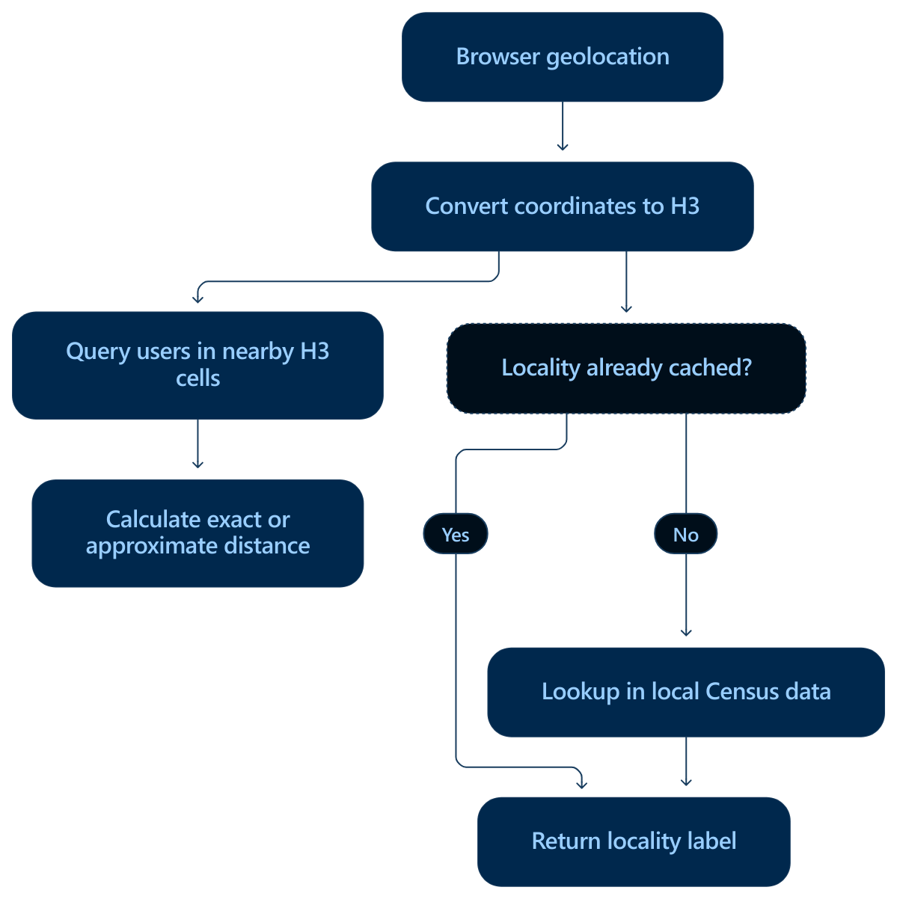

# MLink Locality Design

<!-- Author: Andrew Velez <andrewvelez@outlook.com> -->

## Purpose and constraints

MLink's location model supports U.S. locality-aware discovery through **geocells**: small discovery regions used for rendezvous, profile discovery, caching, message-routing hints, abuse detection, and local network organization.

The geographic infrastructure must cost **$0 to use**. Commercial free tiers do not meet that requirement because location is a universal feature whose usage grows with application activity. The essential geographic search and locality-resolution paths should use device coordinates, local computation, and downloaded reference data, with public government APIs available only as optional fallbacks.

Geographic reference data and live user location are separate concerns:

- **Static or slowly changing data:** administrative boundaries, place names, counties, ZIP Code Tabulation Areas (ZCTAs), and related geographic facts. Download, index, and cache these resources.
- **Dynamic state:** user coordinates, user-to-cell membership, and nearby-user results. These may change continuously, especially while a user travels by car.

Real-time locality search is primarily a dynamic indexing and search problem. It does not require a new geographic-data request for every position update.

## Geocells and the discovery experience

A geocell is a social proximity unit, not merely a fixed map tile. It should represent the people who feel immediately local when the app opens, approximating the first page of a Grindr-style nearby grid.

The guiding rule is:

> A geocell is the smallest MLink discovery region that contains enough visible active users to feel immediately local without becoming noisy.

The conceptual location hierarchy is:

```text
coordinate → base geocell → effective geocell → neighborhood → city → metro
```

The base geocell provides the underlying spatial index; the effective geocell adapts the discovery area to user density. A dense urban area may need only a few blocks, while a rural area may need miles. The objective is a consistent local experience rather than uniform physical size.

Discovery broadens locally first:

```text
current geocell → adjacent geocells → neighborhood → city → metro
```

Distance can help filter and order results without dominating the interface. Proximity labels such as “in your area,” “nearby,” “same neighborhood,” and “across town” can communicate the experience instead of centering it on a measurement such as “437 feet away.”

## Client, server, and privacy responsibilities

The client should perform as much location interpretation and local discovery work as possible. It obtains device coordinates, converts them to a geocell or locality identity, and joins the relevant discovery space. Exact GPS coordinates should remain private when possible.

Servers may assist with rendezvous, validation, abuse controls, rate limits, and fallback delivery. A location record used for computation is not, by itself, a requirement to transmit exact coordinates to a server or expose them to other users. Any shared representation must respect the location-privacy policy in [DESIGN.md](DESIGN.md).

## Geographic components

The source proposals identify the following components for an unmetered geographic path:

| Need | Component | Purpose |
| --- | --- | --- |
| Device coordinates | Browser `navigator.geolocation` | Obtain coordinates after user permission without an application API charge |
| Hierarchical spatial grid | [`h3-js`](https://h3geo.org/docs/) | Convert coordinates to H3 cells and find neighboring or parent cells |
| Distance and geometry | [Turf.js](https://turfjs.org/) | Calculate distances, bounding boxes, buffers, and point-in-polygon relationships locally |
| U.S. boundaries | [Census TIGER/Line files](https://www.census.gov/geographies/mapping-files/time-series/geo/tiger-line-file.html) | Supply places, counties, county subdivisions, roads, ZCTAs, and other geographic boundaries |
| Place-name index | [Census Gazetteer files](https://www.census.gov/geographies/reference-files/time-series/geo/gazetteer-files.html) | Supply geographic identifiers, names, areas, and representative coordinates |
| Additional geographic names | [USGS GNIS](https://www.usgs.gov/us-board-on-geographic-names/download-gnis-data) | Supply populated-place and geographic-feature names as public-domain data |
| Optional lookup fallback | [Census Geocoder](https://geocoding.geo.census.gov/geocoder/Geocoding_Services_API.html) | Resolve U.S. addresses or coordinates to Census geography without a usage charge |
| Optional boundary fallback | [TIGERweb REST](https://tigerweb.geo.census.gov/tigerwebmain/TIGERweb_restmapservice.html) | Query hosted Census geographic layers |
| Optional map rendering | [MapLibre GL JS](https://maplibre.org/maplibre-gl-js/docs/) or [Leaflet](https://leafletjs.com/) | Render maps; these libraries do not themselves supply production map tiles |

Essential search should continue functioning without the optional Census services.

## Density-adaptive H3 indexing

H3's hierarchy supports fine-grained indexing and broader discovery or stronger location privacy through parent cells. The source brainstorm gives these approximate average cell areas:

| H3 resolution | Average area |
| ---: | ---: |
| 6 | 36.1 km² |
| 7 | 5.16 km² |
| 8 | 0.74 km² |
| 9 | 0.105 km² |

The application can index users at a relatively fine resolution and select a broader effective region when needed. H3 cells organize proximity searches; Census boundaries supply human-readable locality labels. The conceptual neighborhood, city, and metro levels should therefore not be treated as interchangeable with H3 parent cells.

## Live location records and nearby-user search

Each active user needs an ephemeral location record. The brainstorm's illustrative record contains:

| Field | Purpose |
| --- | --- |
| `userId` | Identify the user associated with the record |
| `latitude`, `longitude` | Hold the position used for location calculations, subject to the privacy policy |
| `cell` | Identify the user's indexed H3 cell |
| `updatedAt` | Track freshness and expiration |

The search sequence is:

1. Receive a device position update.
2. Convert latitude and longitude to an H3 cell.
3. Compare the new position and cell with the indexed record, applying the update rules below.
4. Update the record when needed. Moving a user changes their index membership; it does not rebuild the geographic reference index.
5. Query the current and neighboring cells for candidate users, broadening discovery as needed.
6. Calculate exact or approximate candidate distances with Turf or a direct great-circle calculation, according to the available location precision.
7. Filter and order the results.

### Update frequency and expiration

The app should coalesce meaningful position changes rather than write a new server location for every GPS event:

- Ignore small movements consistent with GPS jitter.
- Update the indexed record after crossing an H3 boundary or moving a chosen minimum distance.
- Refresh periodically so an unchanged position does not become stale.
- Increase the movement threshold at driving speed.
- Expire records that have not been refreshed within the accepted time window.

The search origin can change more frequently than the locality label. A city or census-designated-place label only needs recomputation when the relevant geographic area changes.

## Static locality data and caching

Prepare the reference data separately from live location updates:

1. Download current Census boundary and Gazetteer files during a build or maintenance process, with GNIS supplying additional geographic names.
2. Convert the data into a compact application-specific spatial index, potentially partitioned by state or region.
3. Resolve coordinates against the local index.
4. Cache mappings such as `H3 cell → locality` for reuse. Users in the same cell will usually receive the same label; the source proposal does not establish a universal one-label-per-cell rule.
5. Use the Census Geocoder only for missing or ambiguous cases, with TIGERweb available as an optional boundary-query fallback.

This makes locality resolution an occasional cache-fill operation rather than an API request for every user or GPS update.

## Diagram walkthrough



The diagram shows the following steps:

1. **Browser geolocation:** obtain the device's current coordinates after the user grants permission.
2. **Convert coordinates to H3:** determine the H3 cell for the position. The flow then branches into nearby-user discovery and locality-label resolution.
3. **Nearby-user branch — query users in nearby H3 cells:** retrieve the candidate users associated with the surrounding discovery area.
4. **Nearby-user branch — calculate exact or approximate distance:** calculate distances for those candidates. This is the final box on this branch; filtering and ordering are described in the search model above.
5. **Locality branch — check whether the locality is already cached:** look for an existing locality mapping for the cell.
6. **Cache hit (“Yes”):** return the cached locality label directly, skipping the Census lookup.
7. **Cache miss (“No”):** look up the locality in local Census data, then return the resulting label.

The accompanying caching proposal also calls for saving a newly resolved mapping for later requests. The diagram does not draw a separate cache-write step or the optional government API fallbacks.

## Services excluded from the critical path

Commercial providers with free monthly quotas are excluded because usage beyond a quota introduces a billing dependency.

The brainstorm also excludes the public OpenStreetMap Nominatim service as a universal production dependency. It cites a one-request-per-second application limit, restrictions on client-side autocomplete, caching and attribution requirements, and the possibility of withdrawn access. It describes the standard OpenStreetMap tile service as best-effort and unsuitable for bulk or offline downloading. These are the source document's service-policy rationale; any future integration needs to check the provider's current terms.

Map rendering and map-tile availability are separate decisions. Choosing a rendering library does not resolve the cost or offline-use constraints of a tile provider.

## Decisions left open by the source proposals

- The base H3 resolution, target number of visible active users, and rules for selecting or expanding an effective geocell.
- The minimum movement distance, driving-speed threshold, refresh interval, and record-expiration window.
- The placement and permitted precision of shared location records within the client/server discovery model, consistent with the privacy policy in `DESIGN.md`.
- The handling of ambiguous cell-to-locality mappings and the definitions or data sources for neighborhood and metro discovery scopes.

These values and mechanisms are not specified by the two source documents or the diagram.
